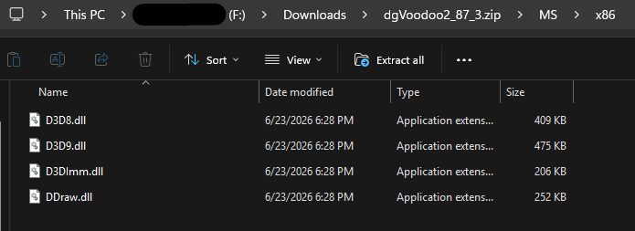
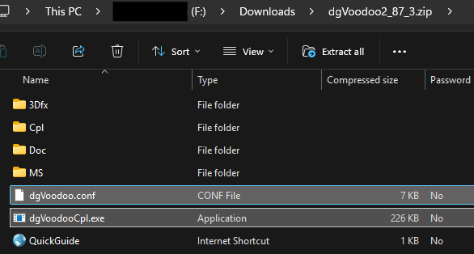
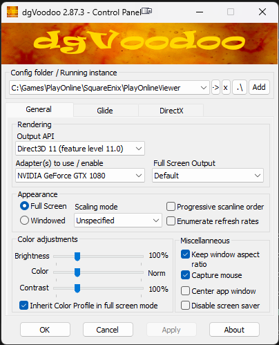
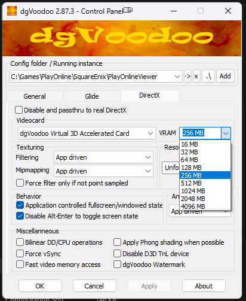

# FFXI Modernization Guide - (Updated August 27th, 2026)

*Final Fantasy XI* is a classic MMO design, but under the hood, it’s powered by a graphics engine built in 2002. If you boot up the game natively on a gaming rig with a GPU like a Nvidia GTX 1080 or better—you are going to get jagged edges, blurry textures, and bizarre frame rate drops when the screen gets crowded. 

Why? Because FFXI runs on **DirectX 8**. Modern Windows absolutely hates DirectX 8. It forces your CPU to do all the heavy lifting while your expensive graphics card essentially sits there asleep.

To fix this, we need to create a three-part pipeline:
1. **dgVoodoo 2:**  (Shifts the workload to your GPU)
2. **Windower:**  (Handles resolution scaling and frame rates)
3. **GPU Control Panel:** (Eliminates micro-stutters and blurry textures)

Here is exactly how to set them up so they work together without crashing your game.

---

## Part 1: dgVoodoo 2

Think of dgVoodoo 2 as a real-time language translator. It intercepts the ancient DirectX 8 code that FFXI spits out and instantly translates it into modern DirectX 11. Suddenly, your modern graphics card knows exactly how to render the game, giving you a massive boost in stability.

**The Golden Rule of dgVoodoo in FFXI:** You only use it for the translation. You do **not** use it to force graphical upgrades like resolution or Anti-Aliasing. If you do, it will fight with Windower and cause UI glitches.

**How to set it up:**
1. Download dgVoodoo 2 and extract it. <a href="https://github.com/dege-diosg/dgVoodoo2/releases/tag/v2.87.3" target="_blank" rel="noopener noreferrer">https://github.com/dege-diosg/dgVoodoo2/releases/tag/v2.87.3</a>
   - You will want the <a href="https://github.com/dege-diosg/dgVoodoo2/releases/download/v2.87.3/dgVoodoo2_87_3.zip">https://github.com/dege-diosg/dgVoodoo2/releases/download/v2.87.3/dgVoodoo2_87_3.zip</a> - 8/27/2026
2. Navigate into its `MS\x86` folder and copy `D3D8.dll`, `D3D9.dll`, `D3Dlmm.dll`, `DDraw.dll`.<br>
   
4. Paste those files, along with `dgVoodooCpl.exe`(<b>the control panel</b>) and `dgVoodoo.conf` a , directly into your FFXI `PlayOnlineViewer` folder.<br>
   
5. Open the control panel and set the following in the **General Tab**:
   * **Output API:** Direct3D 11 (feature level 11.0)
   * **Adapter(s) to use / enable:** < YOUR VIDEO CARD >
   * **Appearance:** > Full Screen
   
7. Open the control panel and set the following in the **DirectX Tab**:
    * **VRAM:** 1024 MB (Plenty for standard HD play. Only go higher if using massive 4K texture mods).
    * **Resolution:** Unforced (Crucial! Let Windower handle this).
    * **Filtering & Antialiasing:** App Driven.
    * **Fast video memory access:** UNCHECK this (it corrupts Windower screenshots).
    

# GPU VRAM Comparison Guide

A quick-reference guide comparing Video RAM (VRAM) capacities across modern and legacy graphics card generations from NVIDIA, AMD, and Intel.

## 📊 Comprehensive VRAM Comparison Chart

| VRAM Size | 🟢 NVIDIA GeForce Models | 🔴 AMD Radeon Models | 🔵 Intel Arc Models |
| :--- | :--- | :--- | :--- |
| **32 GB** | RTX 5090 | — | — |
| **24 GB** | RTX 4090 <br> RTX 3090 Ti / 3090 | RX 7900 XTX | — |
| **20 GB** | — | RX 7900 XT | — |
| **16 GB** | RTX 5080 <br> RTX 5070 Ti <br> RTX 4080 Super / 4080 <br> RTX 4070 Ti Super <br> RTX 4060 Ti (16GB) | RX 9070 XT / 9070 <br> RX 9060 XT (16GB) <br> RX 7900 GRE <br> RX 7800 XT <br> RX 7600 XT <br> RX 6950 XT / 6900 XT | — |
| **12 GB** | RTX 5060 <br> RTX 4070 Ti <br> RTX 4070 Super / 4070 <br> RTX 3080 Ti / 3080 (12GB) <br> RTX 3060 (12GB) | RX 9070 GRE <br> RX 7700 XT | Arc B580 |
| **11 GB** | GTX 1080 Ti <br> RTX 2080 Ti | — | — |
| **10 GB** | RTX 3080 (10GB) | — | Arc B570 |
| **8 GB** | RTX 5050 <br> RTX 4060 Ti (8GB) / 4060 <br> RTX 3070 Ti / 3070 <br> RTX 3060 Ti <br> GTX 1080 | RX 9060 <br> RX 7600 <br> RX 6600 XT / 6600 | — |
| **6 GB** | RTX 2060 <br> GTX 1660 Super / 1660 Ti | RX 5600 XT | — |

---

## 💡 Quick Baseline Recommendations
* **8 GB:** Good for budget-oriented 1080p gaming and popular competitive esports titles.
* **12 GB - 16 GB:** The current modern baseline sweet spot for demanding AAA titles at 1440p resolution with maxed settings.
* **20 GB+:** Required for zero-compromise native 4K gaming, high-end 3D rendering workflows, and local AI model generation.


---

## Part 2: Windower

Now that your GPU is actually awake and processing the game, we have an absurd amount of overhead power to spend on making the game look gorgeous. We do this in Windower using a brute-force technique called **Supersampling**.

FFXI separates its user interface (menus, text) from its 3D world (characters, environments). 
* **Window / UI Resolution:** How big the game window is on your monitor.
* **Background Resolution:** How many pixels the 3D world is rendered at.

If you set your UI resolution to `1920x1080`, but set your Background Resolution to `3840x2160` (4K), your graphics card will draw the 3D world in massive 4K, and then squish it down to fit your 1080p screen. 

This completely destroys jagged, "stair-step" edges on 3D models. It is vastly superior to standard Anti-Aliasing (MSAA) because it doesn't cause weird graphical halos around the 2D UI elements. 

**How to set it up:**
1. In your Windower profile edit screen, set your **UI Resolution** to match your monitor.
2. Set your **Background Resolution** to exactly double that size. 
3. **Uncap the frames:** Load the `Config` plugin in Windower. Once in-game, type `//config FrameRateDivisor 1` in the chat to unlock the game from its native 29.4 FPS cap up to a buttery smooth 60 FPS.

> **Image Suggestion:** Place a side-by-side comparison image here. On the left, show a zoomed-in screenshot of a character model with jagged, pixelated edges (No Supersampling). On the right, show the exact same character with perfectly smooth edges (Supersampling enabled via double background resolution).

---

## Part 3: GPU Control Panels 

With the game translated to DX11 and rendering at 4K, we have two final problems to solve: micro-stutters and blurry ground textures. We solve these at the hardware level, but how you do this depends on whether you are Team Green (NVIDIA) or Team Red (AMD). 

For both brands, you must apply these settings specifically to `pol.exe` (PlayOnline Viewer, which runs the FFXI engine). **Do not apply these globally.**

<details>
<summary>🟢 <b>Click here for NVIDIA Users Setup</b></summary>

Open your **NVIDIA Control Panel**, go to **Manage 3D Settings -> Program Settings**, click **Add**, and select `pol.exe`. 

Force the following settings:
* **Power Management Mode: Prefer Maximum Performance.** 
    * *The Nerd Science:* Because FFXI requires so little power, your modern GPU will try to go to sleep to save energy. When you cast a spell, the GPU wakes up, causing a micro-stutter. This setting forces the GPU to stay awake, completely eliminating the hitching.
* **Anisotropic Filtering (AF): 16x.** 
    * *The Nerd Science:* In 2002, developers saved memory by aggressively blurring textures that were far away or viewed at an angle. Forcing 16x AF tells your GPU to keep floor and wall textures razor-sharp all the way to the horizon.
* **Texture Filtering - Negative LOD Bias: Clamp.** 
    * *The Nerd Science:* Required if you use 16x AF. "Clamping" stops distant objects like fences and tree leaves from shimmering or crawling as you run toward them.
* **All Anti-Aliasing options (FXAA, MSAA): OFF.** Let Windower's supersampling handle this to avoid UI glitches.

> **Image Suggestion (NVIDIA):** Place a screenshot of the NVIDIA Control Panel targeting "pol.exe". Highlight the "Power management mode: Prefer maximum performance" setting.
</details>

<details>
<summary>🔴 <b>Click here for AMD Radeon Users Setup</b></summary>

Open **AMD Software: Adrenalin Edition**. Go to **Gaming -> Games**, click the three dots in the top right, and select **Add A Game**. Navigate to your FFXI directory and add `pol.exe`. Click on it to adjust its specific profile.

Force the following settings in the **Graphics** tab:
* **Radeon Anti-Lag & Radeon Chill: OFF.** 
    * *The Nerd Science:* AMD's frame-pacing technology does not play nicely with a 2002 engine capped at 30/60 FPS via Windower. Turning these on will actually *cause* stuttering in FFXI.
* **Advanced -> Anti-Aliasing: Use application settings.** (Let Windower do the heavy lifting here).
* **Advanced -> Anisotropic Filtering: Enabled -> 16x.** (This fixes the blurry textures on roads and fields).
* **Advanced -> Texture Filtering Quality: High.**
* **Advanced -> Surface Format Optimization: Disabled.** 
    * *The Nerd Science:* AMD tries to optimize texture formats on the fly to boost performance. In old, wrapped games like FFXI, this can cause textures to flicker or corrupt. Turn it off.
* **(Optional) Fix the AMD Sleep Stutter:** If you still get micro-stutters as you run around, your AMD card is falling asleep. Go to the **Performance -> Tuning** tab at the top. Select `pol.exe`, choose **Custom**, and enable **GPU Tuning**. Turn on **Advanced Control** and drag the **Min Frequency (MHz)** slider up so it is within 100-200 MHz of your Max Frequency. This forces the card to stay awake.

> **Image Suggestion (AMD):** Place a screenshot of the AMD Adrenalin profile for "pol.exe". Highlight the "Surface Format Optimization: Disabled" and "Anisotropic Filtering: 16x" settings.
</details>

---

## Part 4: XIPivot and HD Textures

Now that the engine is stable, rendering at 4K, and running at a smooth 60 FPS, it's time to fix the actual 2002 art assets. We do this using HD Texture packs (like the legendary **AshenbubsHD** project), which use AI upscaling and manual touch-ups to make the game look like a modern remaster.

We will install these safely using a Windower addon called **XIPivot**. XIPivot intercepts the game's file requests and injects the HD textures on the fly. This is "non-destructive" modding—your original game files are completely safe, and you can turn the mods off with a single text command.

### 1. Adjust dgVoodoo for the Extra Load
Before we install massive textures, we need to give dgVoodoo more memory to work with.
1. Open your `dgVoodooCpl.exe` in your `PlayOnlineViewer` folder.
2. Go to the **DirectX Tab**.
3. Change **VRAM** from `1024 MB` to `2048 MB` or `4096 MB`. *(Your GTX 1080 has 8GB, so 4096 MB is perfectly safe unless you are multi-boxing 3+ characters).*
4. Click Apply and OK.

### 2. Install XIPivot
1. Open your **Windower** launcher.
2. Go to the **Addons** tab, find **XIPivot**, and turn it on (download/enable it).
3. Right-click the XIPivot icon and make sure it is set to "Auto Load."

### 3. Install the Textures (AshenbubsHD)
1. Download your HD texture packs of choice (e.g., AshenbubsHD Zones, UI, or Characters).
2. Navigate to your Windower installation folder: `Windower4\addons\XIPivot\data\DATs`
3. Create a new folder inside `DATs` and name it exactly what the mod is called (e.g., `AshenbubsHD`).
4. Extract all the `ROM` folders from your downloaded texture pack into this new folder. 
   * *File path check:* It should look like this: `Windower4\addons\XIPivot\data\DATs\AshenbubsHD\ROM\...`

### 4. Tell XIPivot to Load the Mods
1. Go to `Windower4\addons\XIPivot\data\` and open `settings.xml` in a text editor (like Notepad).
2. Look for the `<overlays>` tag. Add the exact name of the folder you created. It should look like this:

   ```xml
   <overlays>
       AshenbubsHD
   </overlays>
   ```

3. Save the file.

> **Image Suggestion:** A split-screen comparison showing a vanilla zone (like Lower Jeuno or Ronfaure) on the left, and the AshenbubsHD version on the right. The difference in the cobblestone and grass textures is night and day.

**You are done.** When you log into the game, XIPivot will automatically load the HD textures. If you ever want to see the original 2002 graphics to compare, just type `//pivot list` to see active mods, or remove "AshenbubsHD" from your settings file to return to vanilla.

---

### The Final Checklist
If you followed this guide, you have perfectly compartmentalized the workload:
* **dgVoodoo** is fixing the engine.
* **Windower** is fixing the jagged edges and the frame rate.
* **GPU Control Panels** are fixing the blurry textures and the stuttering. 

Boot up the game, head to your favorite zone, and enjoy Vana'diel exactly how your nostalgia remembers it.
